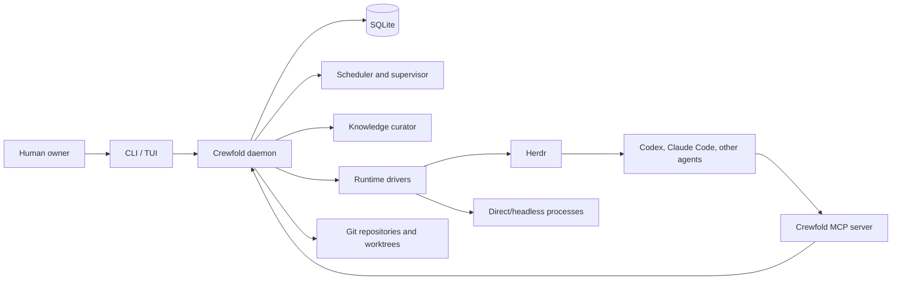

# Crewfold

> The local-first control plane for agent crews.

Crewfold coordinates multiple coding-agent sessions across repositories, branches,
and worktrees. It gives those sessions durable identities, scoped work, shared
knowledge, mailboxes, meetings, and a supervisor without replacing the tools that
already run them.

Crewfold is provider-neutral. Codex, Claude Code, OpenCode, Gemini CLI, shell
workers, CI watchers, and future tools should participate through adapters rather
than forcing the core to understand every terminal UI.

## Status

Crewfold is in its implementation-bootstrap phase. M1 provides a foreground local
daemon with an owner-only Unix socket, protocol negotiation, health status, and
graceful stop. It does not yet contain a database, runtime, or usable orchestrator.

This repository is local only. No upstream GitHub repository or remote is
configured.

## The problem

A terminal multiplexer can display fifty sessions, but it cannot answer:

- What is each agent responsible for?
- Which two agents are unknowingly changing the same behavior?
- What decisions should a newly started agent know?
- Which result is trustworthy, current, and relevant to this task?
- Who is waiting on whom?
- When should a manager interrupt, consolidate, or ask a human?

Copying every transcript into one shared prompt does not solve this. It creates an
append-only pile that gets noisier and more expensive as the crew grows.

Crewfold adds a coordination layer above terminals and model providers. It keeps
the state needed to manage work while leaving source code in Git and execution in
the user's chosen tools.

## Product shape

The first useful version is intentionally personal:

1. One human owns one local Crewfold daemon.
2. Projects point at existing repositories and checkouts.
3. Durable agent definitions describe roles such as implementer, reviewer,
   researcher, context curator, and CI watcher.
4. Runs bind those definitions to real provider sessions.
5. Tasks, claims, messages, meetings, decisions, and knowledge survive session
   restarts.
6. A supervisor detects blocked work and overlaps, then recommends or performs a
   policy-approved coordination action.
7. Herdr is the preferred interactive runtime, but it is not Crewfold's database
   or domain model.

Crewfold should support roughly one hundred registered agent roles on a developer
machine. Only a resource-bounded subset runs concurrently.

## System boundary



Crewfold owns coordination state. Git owns source history. Herdr owns terminal
layout and live terminal processes. Model providers own inference and their native
session formats.

## Core principles

- **Local first.** The daemon, database, sockets, and default knowledge store run
  on the developer's machine.
- **Provider neutral.** Every provider receives the same Crewfold concepts through
  a stable adapter and MCP contract.
- **Durable coordination, ephemeral inference.** An agent run may die; its task,
  messages, decisions, and handoff remain.
- **Curated context.** Raw observations are evidence, not automatically shared
  truth.
- **Explicit ownership.** Tasks and code areas use claims and leases rather than
  relying on agents to infer activity from `git status`.
- **Bounded autonomy.** Supervisors operate under declared budgets and approval
  policies.
- **Human legibility.** Important actions and decisions must be inspectable without
  reconstructing a model transcript.
- **Progressive scale.** The personal product must leave clean boundaries for a
  later multi-user control plane, but does not implement one prematurely.

## Repository map

| Path | Purpose |
| --- | --- |
| `cmd/crewfold/` | Go entry point for the CLI and future daemon |
| `internal/` | Local control-plane packages, currently M0 CLI/build metadata |
| `protocol/` | Versioned API, event, and adapter schemas |
| `integrations/herdr/` | Preferred interactive runtime driver |
| `integrations/providers/` | Provider adapter contracts and implementations |
| `web/` | Deferred browser console; not part of the first milestone |
| `docs/` | Product, architecture, protocol, and operating decisions |

Start with the [documentation map](docs/README.md), then read the
[vision](docs/vision.md), [product definition](docs/product.md), and
[architecture](docs/architecture.md). The executable delivery sequence is in the
[implementation plan](docs/implementation-plan.md) and
[testing strategy](docs/testing.md).

## Scope of the first implementation

The first vertical slice will prove this loop:

```text
register project -> define agent -> assign task -> launch run
  -> receive progress/message -> detect completion or blockage
  -> store handoff -> stop and resume without losing coordination state
```

It will not initially provide a hosted service, organization accounts, autonomous
merging, a general workflow language, or a vector database.

## Development

The current implementation uses Go 1.26.5 and only the standard library. Run the
complete offline gate:

```sh
./scripts/check.sh
```

`scripts/go.sh` uses `CREWFOLD_GO`, a `go` executable on `PATH`, or the versioned
user-local development toolchain when present. The temporary module path is
`crewfold`; a public import path will be selected only when the upstream namespace
is deliberately created.

## Name

**Crewfold** describes bringing independent agents, people, work, and knowledge
into a coordinated fold. The name is intentionally not tied to one model vendor,
terminal multiplexer, or organizational structure.

## License

Crewfold is intended to become an open-source project, but no license has been
selected yet. Until a `LICENSE` file is added, no open-source license is granted.
Apache-2.0 is the current proposal and remains an owner decision.
