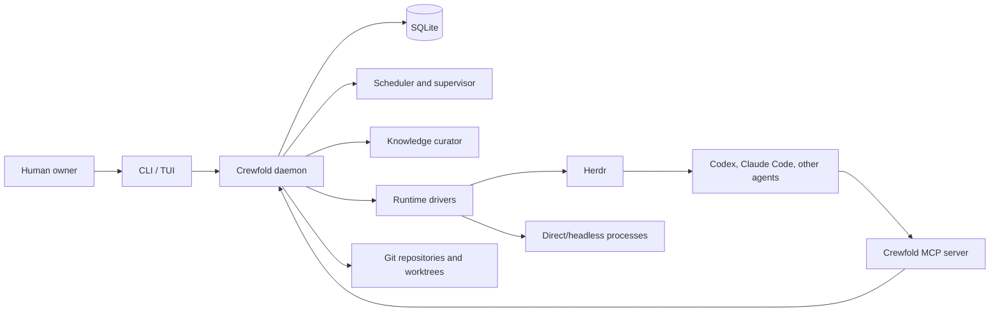

# Crewfold

> The local-first control plane for agent crews.

Crewfold coordinates multiple coding-agent sessions across repositories, branches,
and worktrees. It gives those sessions durable identities, scoped work, shared
knowledge, mailboxes, meetings, and a supervisor without replacing the tools that
already run them.

Its central promise is management comprehension: when agents produce more code
than one person can inspect, Crewfold must still let the owner understand what was
delivered, why it was done that way, what evidence supports it, what remains risky
or unknown, and which decision needs human attention. That understanding comes
from structured, provenance-linked outcomes—not from reading every session or
combining agent-written summaries.

Crewfold is provider-neutral. Codex, Claude Code, OpenCode, Gemini CLI, shell
workers, CI watchers, and future tools should participate through adapters rather
than forcing the core to understand every terminal UI.

## Status

Crewfold is in its implementation-bootstrap phase. The current binary provides a
foreground local daemon, an owner-only Unix socket, and durable workspace,
project, repository, checkout, agent, objective, task, dependency, assignment,
lease, budget, run, placement, timeline, handoff, and event records in SQLite. It
can execute the complete task-to-run-to-handoff lifecycle with deterministic fake
adapters or a supervised, bounded local fixture subprocess across adjacent
standalone clones and linked worktrees. It persists process bindings, reconciles
children across daemon restart, exposes capped logs with API redaction, and
supports timeout and graceful-stop fallback. Runs now bind immutable, bounded
context packets and can use an authenticated, run-scoped MCP surface for briefing,
status, structured progress/blockage/completion reports, text artifacts, and
durable agent mail. One agent can send bounded, task-scoped mail while another is
offline; the recipient later receives, reads, acknowledges, and replies without
using terminal output as coordination state. Delivery survives daemon restart,
and best-effort runtime wake-up is recorded separately from the durable message.
The direct `fixture-mcp` worker proves that loop across adjacent standalone clones.
The provider-neutral `fixture-terminal` worker now passes the same task and
two-agent messaging loop inside isolated Herdr workspaces. Crewfold probes Herdr's
installed API schema, follows stable terminals across pane moves, reconciles after
daemon restart, delivers prompt-based mailbox wakes, and exposes attach,
interrupt, stop, and pane logs without treating terminal lifecycle as completion
authority. The first concrete provider edge is now implemented for Codex:
`doctor --provider codex` verifies the installed headless/MCP surface and
authentication, `codex exec` receives an isolated run-scoped MCP configuration,
and a STDIO bridge keeps the capability token out of arguments and terminal
output. A recorded Codex endpoint proves the full offline task-to-handoff path.
The owner-authorized disposable real-model canary also passes end to end while
remaining deliberately gated on explicit network/model-usage opt-in. On hosts
that cannot nest Codex's Linux sandbox, its test-only container route supplies an
independent outer boundary. The second provider edge is now offline-proven for
Claude Code: its no-model doctor, strict run-scoped launch, failure boundaries,
and a Codex-to-Claude handoff through curated Crewfold context and durable mail all
pass. The installed-Claude canary remains an optional release and upgrade
conformance check, not a development gate. Crewfold now detects deterministic
claim overlap and resolves it through durable two-/three-agent meetings with
frozen inputs, explicit authority, restart-safe positions, and atomic task/claim
actions. The canonical knowledge core now preserves task/meeting-provenanced
decisions and findings as immutable revisions: authenticated runs may propose,
while the local owner accepts, rejects, marks stale, or accepts an explicit
successor. Context packet v4 can deliver exact accepted/current revision snapshots
to a replacement run under fixed byte budgets without reading provider
transcripts. It also freezes an event cursor, bounded reverse dependents, exact
participant rosters, and explicit live-delivery policy. Owner-triggered refresh
builds at most one immutable bounded delta; only the exact run can fetch and
acknowledge it through MCP, while unsafe incremental drift requires visible
rebase. Crewfold can now discover eligible canonical revisions through
deterministic scoped FTS5 search, explain the exact rank tuple and derived-index
generation, diagnose degraded retrieval, and explicitly rebuild the index without
changing canonical state. Agents assigned to different registered projects can
now negotiate through an owner-created participant thread: exact agent/task/project
bindings preserve direct-mail isolation, offline delivery, origin provenance, and
single-recipient semantics across adjacent unrelated repositories. One bounded
deterministic curator rule now safely copies accepted meeting resolutions under
explicit owner configuration. Exact-revision contradiction reports remain inert
until owner confirmation; an open record then quarantines both exact participants
from search and new explicit context without changing currency or historical
packets. Model-assisted curation, semantic conflict detection, broader knowledge
types, and the operator TUI remain to come. A deterministic
project knowledge bundle now exports and owner-imports complete canonical
item/revision/source/applicability and contradiction snapshots without provider
state, operational ghost tasks, or reliance on FTS.

This repository is local only. No upstream GitHub repository or remote is
configured.

## The problem

A terminal multiplexer can display fifty sessions, but it cannot answer:

- What is each agent responsible for?
- Which two agents are unknowingly changing the same behavior?
- What decisions should a newly started agent know?
- Which result is trustworthy, current, and relevant to this task?
- Who is waiting on whom?
- When should a manager interrupt, consolidate, or ask a human?

Copying every transcript into one shared prompt does not solve this. It creates an
append-only pile that gets noisier and more expensive as the crew grows.

Crewfold adds a coordination layer above terminals and model providers. It keeps
the state needed to manage work while leaving source code in Git and execution in
the user's chosen tools.

## Product shape

The first useful version is intentionally personal:

1. One human owns one local Crewfold daemon.
2. Projects point at existing repositories and checkouts.
3. Durable agent definitions describe roles such as implementer, reviewer,
   researcher, context curator, and CI watcher.
4. Runs bind those definitions to provider sessions through independent runtime
   and provider adapters.
5. Tasks, claims, messages, meetings, decisions, and knowledge survive session
   restarts.
6. A supervisor detects blocked work and overlaps, then recommends or performs a
   policy-approved coordination action.
7. Outcome assessments and project briefings explain accepted delivery, evidence,
   risk, and required owner decisions without reconstructing sessions.
8. Herdr is the preferred interactive runtime, but it is not Crewfold's database
   or domain model.

Crewfold should support roughly one hundred registered agent roles on a developer
machine. Only a resource-bounded subset runs concurrently.

## System boundary



Crewfold owns coordination state. Git owns source history. Herdr owns terminal
layout and live terminal processes. Model providers own inference and their native
session formats.

## Core principles

- **Local first.** The daemon, database, sockets, and default knowledge store run
  on the developer's machine.
- **Provider neutral.** Every provider receives the same Crewfold concepts through
  a stable adapter and MCP contract.
- **Durable coordination, ephemeral inference.** An agent run may die; its task,
  messages, decisions, and handoff remain.
- **Curated context.** Raw observations are evidence, not automatically shared
  truth.
- **Explicit ownership.** Tasks and code areas use claims and leases rather than
  relying on agents to infer activity from `git status`.
- **Bounded autonomy.** Supervisors operate under declared budgets and approval
  policies.
- **Human legibility.** Important actions and decisions must be inspectable without
  reconstructing a model transcript.
- **Progressive scale.** The personal product must leave clean boundaries for a
  later multi-user control plane, but does not implement one prematurely.

## Repository map

| Path | Purpose |
| --- | --- |
| `cmd/crewfold/` | Single Go entry point for the CLI and foreground daemon |
| `internal/` | Local API, daemon, CLI, domain records, and SQLite store |
| `protocol/` | Versioned API, event, and adapter schemas |
| `integrations/herdr/` | Preferred interactive runtime driver |
| `integrations/providers/` | Provider adapter contracts and implementations |
| `web/` | Deferred browser console; not part of the first milestone |
| `docs/` | Product, architecture, protocol, and operating decisions |

Start with the [documentation map](docs/README.md), then read the
[vision](docs/vision.md), [product definition](docs/product.md), and
[architecture](docs/architecture.md). The executable delivery sequence is in the
[implementation plan](docs/implementation-plan.md) and
[testing strategy](docs/testing.md).

## Scope of the first implementation

The first vertical slice will prove this loop:

```text
register project -> define agent -> assign task -> launch run
  -> receive progress/message -> detect completion or blockage
  -> store handoff -> stop and resume without losing coordination state
```

It will not initially provide a hosted service, organization accounts, autonomous
merging, a general workflow language, or a vector database.

## Development

The current implementation uses Go 1.26.5 plus a vendored CGO-free SQLite driver.
Run the complete offline gate:

```sh
./scripts/check.sh
```

`scripts/go.sh` uses `CREWFOLD_GO`, a `go` executable on `PATH`, or the versioned
user-local development toolchain when present. The temporary module path is
`crewfold`; a public import path will be selected only when the upstream namespace
is deliberately created.

## Name

**Crewfold** describes bringing independent agents, people, work, and knowledge
into a coordinated fold. The name is intentionally not tied to one model vendor,
terminal multiplexer, or organizational structure.

## License

Crewfold is intended to become an open-source project, but no license has been
selected yet. Until a `LICENSE` file is added, no open-source license is granted.
Apache-2.0 is the current proposal and remains an owner decision.
