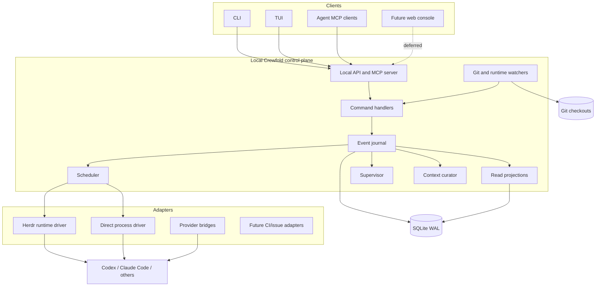
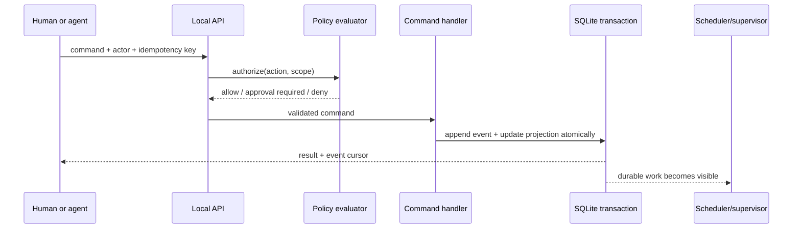

# Architecture

## Overview

Crewfold is a local daemon with several clients and replaceable adapters. The
daemon owns durable coordination state. Clients never infer that state solely from
terminal buffers or provider session logs.



## Deployment topology

The first deployment contains one binary and one database:

```text
crewfold daemon
  ├─ local Unix socket: commands, queries, subscriptions
  ├─ MCP endpoint: tools and resources for running agents
  ├─ SQLite database in WAL mode
  ├─ runtime-driver processes or CLI calls
  └─ bounded background loops: scheduler, watchers, curator queue
```

The CLI can start the daemon on demand. A foreground mode makes debugging easy; a
user service may keep it running. The same binary can expose CLI subcommands so
installation remains simple.

Default state locations should follow XDG conventions on Linux:

```text
~/.config/crewfold/config.yaml
~/.local/share/crewfold/crewfold.db
~/.local/state/crewfold/crewfold.log
~/.cache/crewfold/
```

No daemon state should be written into a managed repository unless the owner
explicitly initializes a project-local `.crewfold/` configuration directory.

## Command path

All mutations follow one path:



Runtime observations enter through the same validated command path. There is no
special back door by which terminal text can mutate task or knowledge state.

## Core modules

### Local API

Provides commands, queries, and subscriptions over a user-owned Unix socket. The
wire contract is versioned and described by JSON Schema. A loopback TCP listener
is not enabled by default.

The API supports:

- idempotency keys for mutations;
- optimistic concurrency through expected revision numbers;
- event cursors for watch/resume;
- actor identity on every command;
- machine-readable errors and human-readable explanations.

### MCP server

Exposes a safe subset of Crewfold capabilities to coding agents. It translates MCP
tool calls into the same internal commands used by the CLI. MCP is not the daemon's
storage model and does not receive privileged actions by default.

### Command handlers

Enforce domain invariants, create stable IDs, evaluate expected revisions, and
append canonical events. Handlers do not launch processes while holding a database
transaction. Instead, they record intent for a worker to execute.

### Event journal and projections

Every accepted mutation produces an immutable coordination event. Current-state
tables are updated in the same SQLite transaction for efficient queries. This is
not a commitment to a large event-sourcing framework; it is a compact audit journal
plus rebuildable projections.

### Scheduler

Matches ready tasks with eligible agent definitions, available checkouts, runtime
capacity, and policy. It produces an explainable placement proposal or a blocked
reason. Process launch happens through a runtime driver after the placement is
committed.

### Supervisor

Consumes task, run, claim, message, and watcher events. It applies deterministic
rules first and may ask a manager model for a recommendation when judgment is
useful. Recommendations do not gain more authority because a model generated them.

### Context curator

Maintains the difference between evidence and accepted shared knowledge. It can
extract proposed decisions, findings, risks, and summaries from structured agent
reports. Automatic acceptance is limited to low-risk scopes and explicit rules.

### Watchers

Watchers observe:

- provider/runtime lifecycle;
- Git branch, HEAD, working-tree changes, and touched paths;
- local check processes;
- timers, leases, budgets, and stale heartbeats.

They emit observations with provenance. Reconciliation logic decides what those
observations mean for durable state.

M3's synchronous Git observer is the first watcher seam. It accepts a concrete
directory and never assumes `git worktree` ownership: adjacent clones and linked
worktrees are both checkouts. It executes only bounded `rev-parse`, `rev-list`, and
`status` commands with optional locks, filesystem-monitor hooks, untracked-cache
writes, automatic maintenance, and terminal prompting disabled. Repository
identity comes from history observations; checkout identity comes from the
normalized local path and a durable opaque ID.

### Runtime drivers

Runtime drivers create, attach, prompt, observe, and stop execution environments.
Herdr is the first-class interactive driver. A direct-process driver supports
headless tools, tests, and deterministic integration tests.

### Provider bridges

Provider bridges add capabilities beyond generic terminal interaction, such as
native resume identifiers or lifecycle hooks. The core only depends on normalized
capabilities and events.

## Sources of truth

| Concern | Authority |
| --- | --- |
| Source contents and commit graph | Git and filesystem |
| Terminal topology and live pane buffers | Runtime driver, initially Herdr |
| Provider-private conversation/session | Provider tool |
| Tasks, assignments, claims, messages, meetings | Crewfold database |
| Accepted project knowledge and decisions | Crewfold knowledge records |
| Authorization and autonomy limits | Crewfold policy configuration |
| External CI or issue status | External system, cached as observation |

Crewfold stores identifiers and evidence pointers across these boundaries. It does
not pretend that a cached observation is the external system itself.

## Consistency and failure handling

### Transactional intent, asynchronous effect

Launching an agent is a saga:

1. Commit `run.requested` with task, agent, checkout, and limits.
2. Runtime worker attempts the launch with an idempotency token.
3. Commit `run.started` with the runtime handle, or `run.start_failed`.
4. Reconciliation checks for orphaned processes after a crash.

The same pattern applies to prompts, stops, meetings, and external actions.

### Leases

Assignments and claims use renewable leases. Expiry makes abandonment visible but
does not silently erase evidence or assume that a process stopped writing. A
supervisor reconciles expired ownership before reassignment.

### Idempotency

Every side-effect request has a stable operation ID. A runtime adapter must return
the existing result or a reconciled state when the same request is repeated after
a crash.

### Backpressure

Queues are durable and bounded. Background work has concurrency classes. New
launches stop before status collection, message delivery, or lease renewal becomes
unreliable.

## Extension boundary for organization mode

The organization product would replace or extend the local API transport,
identity, database, scheduler placement, and audit retention. It should reuse the
domain concepts, protocol semantics, adapter SDK, and local node. The local daemon
can eventually become an authenticated edge worker rather than being discarded.

That evolution depends on never using filesystem paths or operating-system UIDs as
globally meaningful identities. Durable IDs are opaque; paths and local users are
attributes scoped to a node.
