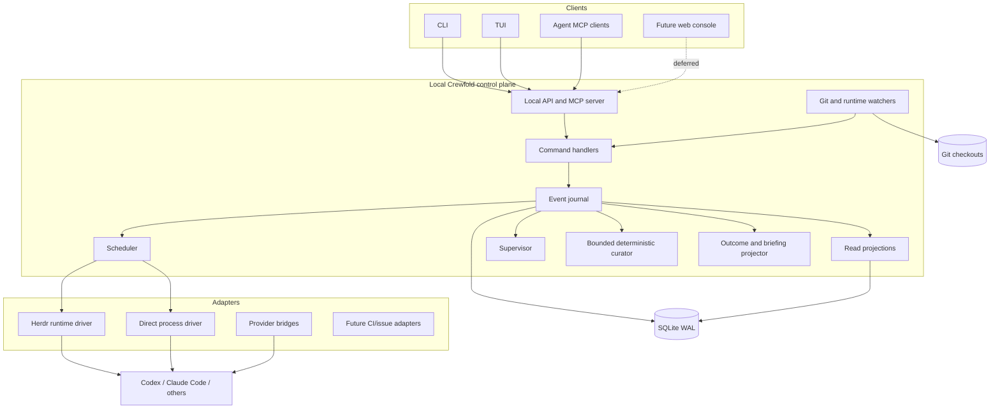
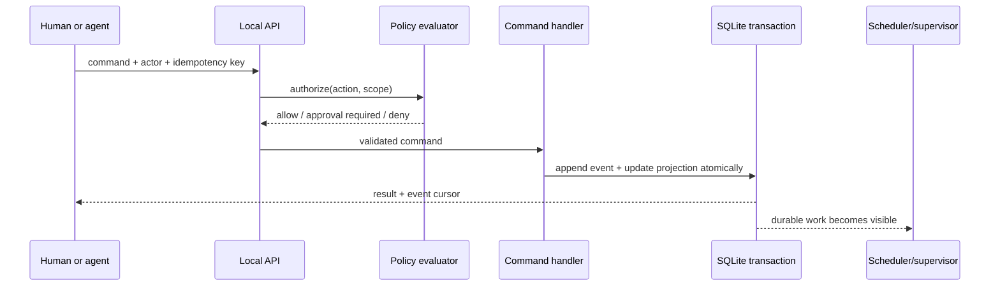

# Architecture

## Overview

Crewfold is a local daemon with several clients and replaceable adapters. The
daemon owns durable coordination state. Clients never infer that state solely from
terminal buffers or provider session logs.



## Deployment topology

The first deployment contains one binary and one database:

```text
crewfold daemon
  ├─ owner-only Unix socket: local API plus run-scoped JSON-RPC/MCP
  ├─ SQLite database in WAL mode
  ├─ runtime-driver processes or CLI calls
  └─ bounded background loops: scheduler and watchers
```

Canonical knowledge and explicit packet assembly run through normal transactional
commands. Deterministic retrieval now uses a rebuildable SQLite FTS5 projection;
the explicit curator projects proposed revisions and applies one bounded,
disabled-by-default rule. Live context uses explicit owner refresh and immutable,
bounded deltas; semantic or model-assisted automatic selection remains future
work.

The CLI can start the daemon on demand. A foreground mode makes debugging easy; a
user service may keep it running. The same binary can expose CLI subcommands so
installation remains simple.

Default state locations should follow XDG conventions on Linux:

```text
~/.config/crewfold/config.yaml
~/.local/share/crewfold/crewfold.db
~/.local/state/crewfold/crewfold.log
~/.cache/crewfold/
```

No daemon state should be written into a managed repository unless the owner
explicitly initializes a project-local `.crewfold/` configuration directory.

## Command path

All mutations follow one path:



Runtime observations enter through the same validated command path. There is no
special back door by which terminal text can mutate task or knowledge state.

## Core modules

### Local API

Provides commands, queries, and subscriptions over a user-owned Unix socket. The
wire contract is versioned and described by JSON Schema. A loopback TCP listener
is not enabled by default.

The API supports:

- idempotency keys for mutations;
- optimistic concurrency through expected revision numbers;
- event cursors for watch/resume;
- actor identity on every command;
- machine-readable errors and human-readable explanations.

### MCP server

Exposes a safe subset of Crewfold capabilities to coding agents. It translates MCP
tool calls into the same internal commands used by the CLI. MCP is not the daemon's
storage model and does not receive privileged actions by default.

The implemented server recognizes MCP envelopes on the existing Unix socket. A
node-secret HMAC token authenticates one run through request metadata; ordinary
tool arguments cannot select a different identity. The database stores capability
expiry and immutable context binding, never the credential. Resource and tool
scope violations are denied and audited. The same identity derives mailbox sender,
recipient visibility, project scope, and thread-participant authority; agents
cannot select a different sender or run in message tool arguments. The implemented
`crewfold_propose_knowledge` tool similarly fixes proposal actor, workspace,
project, and primary provenance to the authenticated run and its task. The
implemented `crewfold_report_contradiction` tool derives the same run authority
and can report only two accepted/current exact revisions applicable to its project
and task. Neither tool can accept knowledge or confirm a contradiction.

Runs whose frozen current packet allows live-context delivery additionally receive
`crewfold_get_context_delta` and `crewfold_acknowledge_context_delta`. The first has no arguments and can only
fetch a delta already built by the owner for the authenticated run. The second
accepts only that run's exact pending delta, expected run-local sequence, and an
idempotency key. It is the sole consumption-attestation path. A packet without
these tools does not advertise them, and the local owner cannot acknowledge on an
agent's behalf.

Check-watcher runs carry one exact project grant in the current packet with exact
definition revisions and closed `run|inspect|propose_repair` operations. A packet
cannot carry both a check-watch grant and a manager grant. Every call
revalidates the live run and current grant; no tool argument can select actor,
project, checkout, command, evidence class, or recipient. Agent role and launch
profile purpose are not authority inputs.

Project scope remains the mailbox default. An owner-created participant thread is
the sole cross-project exception: it binds every member to an exact agent, task,
and project. The same existing inbox/read/send/acknowledge tools accept a message
only when the authenticated run exactly matches a binding; a different task for
the same agent has no authority. Agents cannot create or extend the roster, and a
message still has one recipient. This enables an application and a library agent
to negotiate across adjacent repositories without opening workspace-wide chat.

### Command handlers

Enforce domain invariants, create stable IDs, evaluate expected revisions, and
append canonical events. Handlers do not launch processes while holding a database
transaction. Instead, they record intent for a worker to execute.

### Event journal and projections

Every accepted mutation produces an immutable coordination event. Current-state
tables are updated in the same SQLite transaction for efficient queries. This is
not a commitment to a large event-sourcing framework; it is a compact audit journal
plus rebuildable projections.

Named SQLite queries are compiled into typed Go accessors with pinned `sqlc`.
Generated access owns parameters, nullability, results, and scanning; handwritten
domain services continue to own short transaction boundaries, policy checks, and
event/projection ordering. The embedded current SQL baseline remains the schema authority.

### Scheduler

Matches ready tasks carrying an exact agent-bound launch profile with available
checkouts, runtime capacity, and policy. It produces an explainable placement
proposal or a blocked reason. Process launch happens through a runtime driver
after the placement is committed.

The implemented deterministic scheduler consumes the task's existing active
assignment, verifies the agent's enabled state and runtime/provider configuration,
enforces agent concurrency, and selects a writable checkout in the task's project.
Checkout eligibility depends on availability and write policy, not Git layout:
adjacent clones and linked worktrees are equal inputs. The selected placement and
its reasons are durable before the asynchronous worker sees the job.

M16 extends placement without moving launch authority into model output. Accepted
work names an exact owner-defined launch profile whose project and agent revision
are the complete scheduling-eligibility binding. Profile purpose and agent role
are workflow metadata only. The scheduler evaluates ready work in stable order and
rechecks global, project, provider, agent, checkout, dependency, and claim capacity
in one immediate transaction. That transaction creates or renews the assignment, acquires required
claims, builds and binds context, creates the run/job, and records one supervisor
action, explanation, event, receipt, and idempotency result before any runtime
driver is called.

The scheduling receipt freezes launch authority for that one operation. The
worker still checks the exact receipt/job/run, current task, and active assignment
link before starting, but it does not re-rank or revoke the committed run because
the profile is later retired, the agent definition is later disabled/revisioned,
or wall time crosses the assignment deadline. Those mutable facts are inputs to a
future placement or retry, which must obtain a new receipt. Reserved-run
reconciliation prevents lease expiry from splitting the committed run from its
assignment.

### Supervisor

Consumes task, run, claim, message, and watcher events. It applies deterministic
rules first and may ask a manager model for a recommendation when judgment is
useful. Recommendations do not gain more authority because a model generated them.

Management-capable agents and the supervisor have intentionally disjoint
authority. Runs with a current manager grant may submit only its typed proposal
kinds; submission is inert and only an owner transaction can accept it. The
supervisor is a subsystem actor whose automatic set initially contains
`schedule_ready`; every action outside the exact current policy becomes an
approval request. Neither surface can invent a launch command, derive authority
from a role string, or impersonate owner acceptance.

### Canonical knowledge, retrieval, and bounded context curator

The implemented canonical store separates stable knowledge items from numbered,
immutable-content revisions. It currently accepts only decisions and findings.
Each proposal freezes one to 16 ordered sources: tasks, concluded meetings, or
accepted proposals from concluded meetings. The primary source derives the
project; an optional task scope narrows applicability. SQLite constraints and
triggers preserve item and revision history, while typed `sqlc` queries load exact
revisions and their ordered provenance.

Proposal and governance use the same transaction/event path as other domain
commands. The local owner may accept, reject, stale, or accept a successor that
atomically supersedes the prior current revision. Agent runs may only propose.
Governance operations reaching the store create inspectable allowed or denied
authority records, and caller payloads never select the trusted actor. The run
capability advertises no governance operation; probes of a reserved acceptance
name stop earlier as audited `run.tool_denied` policy violations.

The current context-packet builder starts from the existing role, task, checkout,
dependency, reverse-dependent, participant-roster, policy, reporting, and
bounded-inbox snapshot. It then evaluates only
the caller's ordered exact revision IDs—never a search result. Accepted, current,
fresh, applicable revisions are embedded as complete snapshots. Other known
candidates receive per-revision exclusion reasons; unknown IDs fail. Superseded
pins may expose a replacement ID as explanation metadata but are never silently
followed.

Packet assembly enforces a 32 KiB total limit, a 12 KiB whole-item knowledge
sub-budget, and an 8 KiB collaboration sub-budget. It records requested IDs,
inclusion/exclusion decisions, budget accounting, the journal high-water, and a
frozen live-delivery policy in the immutable packet. At most 32 reverse
dependents and eight whole exact-bound participant-thread rosters are selected
deterministically. Eligibility is evaluated inside the build transaction. A
prebuilt packet is revalidated once at run binding; after successful binding,
later governance cannot change its immutable bytes and only explicit refresh can
carry a withdrawal or rebase. Provider transcripts are neither queried nor
ingested. This is bounded context authority, not RAG or a transcript accumulator.
An otherwise eligible explicit revision in an
owner-confirmed open contradiction fails the whole new build before budgeting;
an already ineligible revision keeps its ordinary exclusion precedence. Existing
packet bytes never change.

The first M15 retrieval slice adds a disposable FTS5 projection over immutable
revision titles and bodies. Search obtains text candidates from that projection,
then loads canonical records and applies hard workspace, project, optional task,
accepted/current, and freshness rules in one read transaction. Its named
lexicographic rank is applicability, task/dependency provenance affinity,
freshness horizon, confidence, verification, weighted BM25, acceptance time, and
exact revision ID. Results freeze the complete revision, tuple explanations,
canonical cursor, and index generation; they grant no authority and are never
implicitly added to a packet.

Index generation metadata and a deterministic canonical-source digest make
missing, corrupt, inconsistent, and out-of-date state observable. Search fails
closed as `retrieval_degraded`; exact canonical reads and context packets continue.
An explicit idempotent rebuild reconstructs and integrity-checks the projection
without mutating knowledge, context, or the event journal. No second database,
embedding service, or background model is involved.

The second independently testable M15 slice adds participant-bound cross-project
collaboration. A new packet's bounded inbox summary may include exact authorized
participant mail, but full bodies stay behind explicit MCP reads. The current packet
delivers bounded whole rosters and later participant/message changes through the
same exact task binding. The third slice adds a read-projected curator queue over canonical proposals and
immutable derivations. Every workspace persists the single
`accepted_meeting_resolution_copy/v1` rule disabled. An explicit process pass
scans at most 100 candidates, deterministically copies an accepted resolution's
exact agenda and summary into a proposed decision, and accepts at most ten only
after the owner enables that exact rule. Every queue page includes the effective
rule snapshot so an operator can observe its enabled state and optimistic
revision, including after restart.

The auto-accept path revalidates rule/source/output hashes and current states in
one transaction. It records `subsystem:curator` authority with reason
`state_policy`, the normal knowledge acceptance fact, and immutable derivation and
auto-acceptance evidence. The general subsystem governance path remains denied;
quality labels, free text, agents, retrieval rank, messages, and transcripts never
gain acceptance authority. The fourth M15 slice adds exact-pair contradiction
records on a separate lifecycle axis. Agent or owner reports remain proposed;
only the owner can open the record. Open participants are conservatively
quarantined everywhere they otherwise apply, search excludes them before limit,
and exact context assembly fails closed. Dismissal or a participant becoming
stale/superseded closes effective dispute, while already-built packets remain immutable.

The fifth slice adds a deterministic two-file project snapshot. Its manifest
freezes every canonical item/revision/source, effective task applicability anchor,
and contradiction lifecycle snapshot; the Markdown file is a byte-checked human
rendering. Export uses one coherent read transaction and is independent of FTS.
Owner-only import accepts only an exact empty project scope, or creates that exact
scope when explicitly requested, then commits canonical rows, local import
attestations, and receipt atomically. Portable task anchors preserve narrow scope
without creating operational tasks. Origin events, authority ledgers, curator
proof rows, provider state, and idempotency are deliberately not replayed.
Semantic detection and broader reconciliation remain later work; retrieval still
cannot automatically accept, summarize, or deliver knowledge.

The sixth slice adds explicit live context deltas without weakening packet
immutability. Per-run state owns an inspected event cursor, one pending immutable
delta, acknowledged sequence, cumulative byte count, and durable rebase state.
Owner-local refresh scans at most 1,000 potentially applicable events through one
transactional cutoff, reloads canonical projections, and coalesces them into
whole typed changes. A no-op advances the inspected cursor without an event or
empty delta. A pending delta blocks further scanning until the exact authenticated
run acknowledges it through MCP.

One delta is capped at 16 KiB and the chain at 64 KiB. An old base packet, base
contract or direct-dependency-set drift, relevant-event overflow, byte overflow,
or unsupported authority-changing event becomes durable rebase state rather than
partial delivery. Current supported changes are bounded message previews, new or
dispute-closure-reoffered accepted decisions, delivered-knowledge withdrawals,
no-body disputed suppression tombstones, contradiction transitions,
reverse-dependent changes, and participant-roster changes. Direct-upstream
snapshot drift rebases. Time-driven expiry is evaluated only on explicit refresh;
there is no provider steering or background push.

### Outcome and briefing projector

Builds the management view from structured commitments, outcome assessments,
decisions, checks, evidence, risks, overlaps, and follow-up work. Its base
aggregation is deterministic and available even when no manager model or curator
is running. Each read captures the current workspace event high-water and may
apply one exact same-scope owner checkpoint as an exclusive lower bound. The
public API does not accept a caller-selected historical cursor.

The projector preserves provenance and source authority for every material claim.
It explicitly marks weak, stale, missing, disputed, or contradictory support.
The bounded structured projection is the only briefing representation; no model
or narrative renderer sits on its correctness path. Session transcripts are
optional evidence and are not required to build the projection.

### Watchers

Watchers observe:

- provider/runtime lifecycle;
- Git branch, HEAD, working-tree changes, and touched paths;
- local check processes;
- timers, leases, budgets, and stale heartbeats.

They emit observations with provenance. Reconciliation logic decides what those
observations mean for durable state.

M3's synchronous Git observer is the first watcher seam. It accepts a concrete
directory and never assumes `git worktree` ownership: adjacent clones and linked
worktrees are both checkouts. It executes only bounded `rev-parse`, `rev-list`, and
`status` commands with optional locks, filesystem-monitor hooks, untracked-cache
writes, automatic maintenance, and terminal prompting disabled. Repository
identity comes from history observations; checkout identity comes from the
normalized local path and a durable opaque ID.

M12 adds a daemon-owned periodic watcher over only the concrete checkouts bound to
active path claims. It records sorted dirty paths and HEAD, opens/resolves drift
observations, and gives each daemon lifetime a watcher ID so restart scans expose
an observation gap. Manual `overlap scan` uses the same code path. The watcher
never edits Git, turns an adjacent clone into a worktree, or treats repository
identity as checkout identity.

M17 adds a separate bounded check reconciler. It recovers exact direct-runtime
children, obtains fresh Git observations for result freshness, routes typed
notifications, and stales obsolete repair proposals. It processes at most 100
candidates per pass and stops at an unknown journal fact. It does not auto-launch
missing checks.

Only the latest exact-revision check whose launch and terminal observations have
the same clean nonempty HEAD is verification-eligible. A changed HEAD or any
dirty observation makes prior evidence monotonically stale. Dirty runs remain
diagnostic, not verified. Results stay mechanical evidence for one named
criterion and never imply task completion, policy acceptance, push/merge/deploy,
or integration order.

### Runtime drivers

Runtime drivers create, attach, prompt, observe, and stop execution environments.
Herdr is the first-class interactive driver. A direct-process driver supports
headless tools, tests, and deterministic integration tests.

### Provider bridges

Provider bridges add capabilities beyond generic terminal interaction, such as
native resume identifiers or lifecycle hooks. The core only depends on normalized
capabilities and events.

## Sources of truth

| Concern | Authority |
| --- | --- |
| Source contents and commit graph | Git and filesystem |
| Terminal topology and live pane buffers | Runtime driver, initially Herdr |
| Provider-private conversation/session | Provider tool |
| Tasks, assignments, claims, messages, meetings | Crewfold database |
| Accepted project knowledge and decisions | Crewfold knowledge records; open contradictions derive a separate temporary quarantine without changing currency |
| Accepted deliverables and residual outcome risk | Crewfold outcome assessments |
| Verification results | Check systems and evidence records, with source and freshness |
| Management briefing | Derived Crewfold projection; never an independent authority |
| Authorization and autonomy limits | Crewfold policy configuration |
| External CI or issue status | External system, cached as observation |

Crewfold stores identifiers and evidence pointers across these boundaries. It does
not pretend that a cached observation is the external system itself.

## Consistency and failure handling

### Transactional intent, asynchronous effect

Launching an agent is a saga:

1. Commit `run.requested` with task, agent, checkout, and limits.
2. Runtime worker attempts the launch with an idempotency token.
3. Persist the runtime binding before the post-launch acknowledgement boundary.
4. Commit `run.started` with provider binding, or `run.start_failed` when launch
   definitely did not occur.
5. Reconciliation inspects the persisted binding after a crash; an untrustworthy
   process outcome becomes `run.lost` without releasing capacity.

If provider binding fails after a runtime exists, the worker first stops that
known runtime. It records a normal start failure only after cleanup is confirmed;
otherwise it records `run.lost` and preserves the assignment and checkout claim.

The fake runtime currently proves steps 1–3 and replay-safe recovery at the
post-effect/pre-acknowledgement boundary. Its operation ID is the durable run ID;
replaying launch returns the same binding. Requested intents, blocked runs, and
active checkpoints also survive daemon restart through the SQLite worker queue
and persisted scenario cursor.

The direct runtime additionally proves restart across a real process boundary. A
detached per-run supervisor persists process identity, bounded output counts, and
exit/timeout/stop state in owner-only daemon storage. A freshly constructed driver
can reconcile that state after daemon restart while the child continues. The
runtime never treats terminal text or exit zero as task-completion authority; the
fixture provider must still emit a structured completion report and pass domain
acceptance. Current process identity and process-group enforcement are Linux-first.

Local-check execution uses the same intent/effect rule but a separate projection:

1. Commit `check.run_requested`, the check job, and idempotency result.
2. Obtain a real Git observation and commit `check.run_starting` with the exact
   immutable launch receipt and effective-spec digest.
3. Launch or replay the check-run ID through the dedicated direct runtime.
4. Persist its binding, then inspect status without captures.
5. Read text only through bounded redacted logs and atomically commit one terminal
   result, initial freshness, mechanical evidence, and exact routing receipts.
6. If process identity or outcome is untrustworthy, commit one explicit `unknown`
   rather than launch a second possible child.

A later definition retirement or check-grant revocation blocks new requests but
does not alter recovery of the exact already receipted operation.

The same pattern applies to prompts, stops, meetings, and external actions.

Durable mail already applies the pattern at a smaller boundary. Message, recipient,
and optional wake intent commit together. Wake execution happens afterward from a
separate queue. A crash before effect leaves recoverable pending work; a definite
wake failure records its diagnostic while durable delivery remains queued. The
recipient's later inbox read is sufficient for delivery even when no runtime wake
mechanism exists.

### Leases

Assignments and claims use renewable leases. Expiry makes abandonment visible but
does not silently erase evidence or assume that a process stopped writing. A
supervisor reconciles expired ownership before reassignment.

Reconciliation is run-first: reserved or `lost` runs continue consuming all
applicable capacity even if an assignment or claim lease is stale. A proven live
runtime renews ownership, a proven terminal runtime is normalized, temporary
inspection failure retains reservations, and an unknown process identity/outcome
becomes `lost`. No automatic path releases, retries, or reassigns lost work.

### Idempotency

Every side-effect request has a stable operation ID. A runtime adapter must return
the existing result or a reconciled state when the same request is repeated after
a crash.

### Backpressure

Queues are durable and bounded. Background work has concurrency classes. New
launches stop before status collection, message delivery, or lease renewal becomes
unreliable.

## Extension boundary for organization mode

The organization product would replace or extend the local API transport,
identity, database, scheduler placement, and audit retention. It should reuse the
domain concepts, protocol semantics, adapter SDK, and local node. The local daemon
can eventually become an authenticated edge worker rather than being discarded.

That evolution depends on never using filesystem paths or operating-system UIDs as
globally meaningful identities. Durable IDs are opaque; paths and local users are
attributes scoped to a node.
