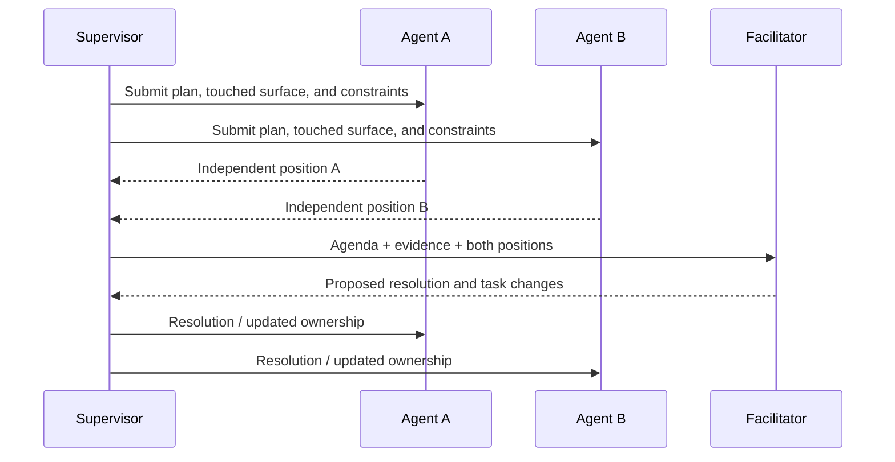

# Coordination model

## Goal

Crewfold makes coordination explicit enough to automate and concise enough for a
human to understand. It avoids both extremes: isolated agents that know nothing of
one another and an unrestricted shared chat that becomes the de facto database.

## Delegation

A manager does not send only a prose prompt. Delegation creates a task contract:

- desired outcome and reason;
- deliverables and acceptance checks;
- dependencies and relevant prior decisions;
- allowed project, checkout, tools, and actions;
- expected paths, components, or APIs;
- time, cost, and retry budgets;
- reporting and escalation expectations.

The receiving agent may accept, reject with a reason, or propose a narrower task.
Acceptance establishes an assignment lease and expected heartbeat, not permanent
ownership.

## Agent-to-agent communication

Agents communicate through Crewfold mailboxes rather than injecting text directly
into one another's terminal sessions.

This gives communication:

- durable delivery even when the recipient is stopped;
- sender identity and authorization;
- task and evidence links;
- acknowledgement and response expectations;
- context-budget-aware summarization;
- an auditable record separate from provider transcripts.

Direct terminal prompting remains a runtime control mechanism. It is used by
Crewfold to deliver a wake-up or instruction to a session, not as the only record
of the underlying message.

### Message kinds

| Kind | Purpose |
| --- | --- |
| `inform` | Concise relevant fact or status |
| `question` | Information needed from a recipient |
| `request` | Requested action that is not a task assignment |
| `review_request` | Ask for structured review of an artifact or task |
| `handoff` | Transfer current state, evidence, and unresolved work |
| `decision_notice` | Announce an accepted or superseded decision |
| `risk` | Raise a risk requiring awareness or action |
| `conflict` | Report overlapping or contradictory work |
| `approval_request` | Ask an authorized actor to approve a gated action |

Urgency does not grant authority. A high-urgency request can still be denied.

## Meetings

A Crewfold meeting is a short orchestration workflow for two or more agents. It is
useful for design conflicts, overlapping work, consolidation, review, and incident
response.

### Meeting lifecycle

```text
proposed -> gathering_context -> active -> resolving -> concluded
                                  |             |
                                  +-> stalled <-+
                                  +-> cancelled
```

### Meeting record

Every meeting contains:

1. **Agenda:** one specific question or conflict.
2. **Participants:** roles selected because they own evidence or authority.
3. **Facilitator:** human or policy-constrained manager agent.
4. **Input snapshot:** relevant tasks, claims, knowledge revisions, diffs, and
   decisions fixed at the start.
5. **Round plan:** parallel independent positions, directed questions, or ordered
   responses.
6. **Resolution rule:** consensus, reviewer recommendation, owner decision, or
   another named authority.
7. **Output:** resolution, dissent, evidence, actions, owners, and deadlines.

### Execution model

Meetings need not be synchronous. Crewfold can request an independent position
from each participant, then give a facilitator the collected positions, then ask
targeted follow-ups. This is cheaper, reproducible, and less prone to one agent's
first answer anchoring everyone else.

For a two-agent overlap:



If the resolution changes scope or authorizes shared mutations, the appropriate
human or policy authority must accept it.

## Overlap detection

Overlap is a scored signal, not a binary guess based only on file paths.

### Inputs

- task-declared paths, symbols, APIs, components, and behaviors;
- active claims and their modes;
- observed Git changes and untracked files;
- imports, dependency graph, schemas, and migrations when indexes exist;
- shared acceptance tests or release operations;
- natural-language task similarity as an optional weak signal.

### Severity

| Severity | Example | Default response |
| --- | --- | --- |
| Informational | Same component, disjoint files | Notify in status |
| Advisory | Same API surface, compatible goals | Open a thread |
| Conflict | Overlapping write claims or contradictory contracts | Pause new scheduling; request resolution |
| Critical | Concurrent migration/release/destructive operation | Gate action and alert owner |

Semantic similarity never independently blocks work. Deterministic claims,
observed writes, and declared constraints carry more weight.

### Consolidation strategies

- Split ownership by file, symbol, layer, or acceptance criterion.
- Sequence tasks and make the second depend on the first handoff.
- Designate one implementer and turn the other into a reviewer.
- Preserve both experiments in separate worktrees and schedule a comparison.
- Create an integration task owned by a third agent.
- Cancel duplicate work when one result is clearly sufficient.

## Scheduling

The scheduler considers:

- dependency readiness;
- agent capability and project eligibility;
- assignment and claim availability;
- checkout write policy;
- runtime/provider concurrency limits;
- time, cost, and token budgets;
- required review independence;
- owner priority and fairness;
- recent failures and cooldowns.

It returns a placement explanation, for example:

```text
Assigned task T-42 to agent api-implementer in checkout world-engine-2.
Reasons: role match, dependency T-37 completed, exclusive checkout available.
Deferred reviewer: project concurrency limit 3/3.
```

The initial scheduler is deterministic. A model may propose task decomposition or
priority changes, but it does not replace the constraint solver.

## Supervisor

The supervisor watches for conditions and chooses from policy-approved responses.

| Condition | Possible response |
| --- | --- |
| Agent blocked on a question | Route question or notify owner |
| Missing heartbeat | Inspect runtime, renew, stop, or mark lost |
| Claim conflict | Notify, open thread, or schedule meeting |
| Dependency completed | Refresh dependent context and enqueue task |
| Run over budget | Stop, request extension, or create handoff |
| Repeated task failure | Reassign, request review, or escalate |
| CI failure | Attach result, notify owners, create repair task |
| Knowledge contradiction | Ask curator/reviewer to reconcile revisions |

Model reasoning is useful for summarizing evidence and proposing responses. The
supervisor's ability to execute a response still comes from deterministic policy.

## Manager hierarchy

Crewfold can represent manager and team-lead roles, but the personal MVP does not
create an elaborate permanent org chart. A shallow default is enough:

```text
owner
└─ workspace manager
   ├─ project implementers
   ├─ reviewers
   ├─ context curator
   └─ CI watcher
```

Task-specific coordinators can be created temporarily. Hierarchies organize
attention and escalation; they do not hide peer messages or confer unrestricted
authority.

## Working in one checkout

Multiple agents may read the same checkout safely. Multiple writers in the same
checkout are inherently risky because filesystem changes are immediate and Git
does not isolate them.

Crewfold therefore:

1. prefers separate Git worktrees for concurrent writers;
2. supports path/symbol claims when shared writing is intentional;
3. shows every writer the other active claims and observed changed paths;
4. detects drift outside claimed scope;
5. can pause or warn based on checkout policy;
6. never promises isolation that the filesystem does not provide.

## CI watcher behavior

A CI watcher is an ordinary agent or deterministic worker with a specialized task.
For local checks it can run allowlisted commands and attach structured results. A
future remote-CI adapter can observe check runs and commit status. It should not
infer merge order from pass/fail alone; dependency and integration policy decide
who goes after whom.
