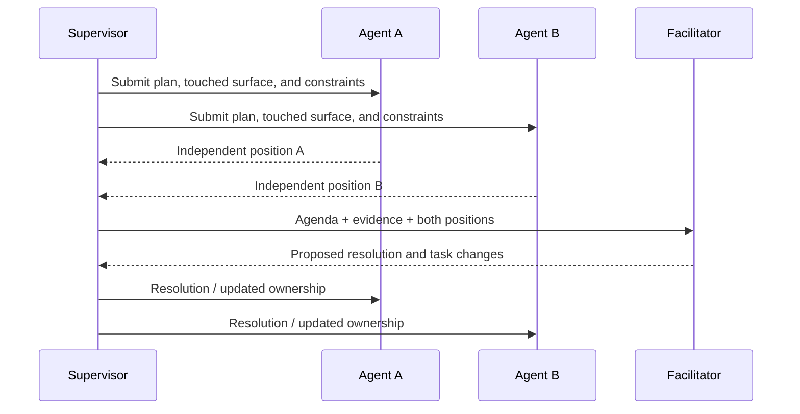

# Coordination model

## Goal

Crewfold makes coordination explicit enough to automate and concise enough for a
human to understand. It avoids both extremes: isolated agents that know nothing of
one another and an unrestricted shared chat that becomes the de facto database.

## Implemented foundation

Crewfold currently implements this foundation of the model:

- durable provider-neutral agent definitions;
- project-scoped objectives and tasks with explicit budgets;
- acyclic task dependencies and deterministic readiness explanations;
- optimistic task revisions;
- one active primary assignment per task with a durable lease/history record;
- ready, assigned, active, blocked, and cancelled coordination transitions;
- a workspace status projection and immutable event history;
- deterministic and direct fixture execution with run-scoped MCP capabilities;
- immutable base context with a bounded authority-scoped inbox summary;
- durable single-recipient messages in direct or owner-created participant
  threads, delivery/read/acknowledgement state, and best-effort wake diagnostics.

The current runtime can start only fixed provider-free fixtures; it does not start
Codex, Claude Code, Herdr, or arbitrary shell commands. Claims, meetings, managers,
and the expanded scheduler described below remain layers built on these records.

## Delegation

A manager does not send only a prose prompt. Delegation creates a task contract:

- desired outcome and reason;
- deliverables and acceptance checks;
- dependencies and relevant prior decisions;
- allowed project, checkout, tools, and actions;
- expected paths, components, or APIs;
- time, cost, and retry budgets;
- reporting and escalation expectations.

The receiving agent may accept, reject with a reason, or propose a narrower task.
Acceptance establishes an assignment lease and expected heartbeat, not permanent
ownership.

## Durable agent hierarchy and staffing

Delegation can create a continuing actor as well as a task. A durable child agent
is appropriate when it owns work beyond one provider turn, needs direct owner or
peer communication, coordinates children, owns an attached resource/service, or
must retain a resumable conversation after its creator stops. Short research,
analysis, and review helpers may remain provider-local subagents and appear only in
the parent's activity.

The durable manager/child graph is an acyclic attention hierarchy. It determines
navigation, reporting, and escalation defaults, but never grants access by role or
ancestry. A manager can create a child only with a current owner-authored staffing
grant that freezes domain, eligible provider/runtime profiles, task classes,
descendant and concurrency ceilings, budget, and expiry. Creation and later
disablement are typed, idempotent, and receipted.

An operating charter makes the expected coordination behavior durable rather than
hoping a descriptive label such as `lead` or `steward` implies it. A
delegation-first charter tells the provider to create appropriately scoped durable
children when a staffing grant permits, while a hands-on charter permits direct
work. Neither policy can manufacture the staffing grant, task, checkout access,
or budget it would need. Workstream grouping is backed by canonical Objective
membership, not a cosmetic browser folder.

The owner may address any durable agent directly. A workstream lead receives
material child reports through durable messages and roll-up projections rather
than terminal scraping. A higher-level domain steward receives accepted outcomes,
interface changes, verification gaps, risks, and owner requests rather than a
concatenation of every child transcript.

A domain-level agent with no workstream placement may inspect every attached
checkout through bounded read-only authority. A workstream agent instead inherits
the workstream's primary checkout, graph, and relevant domain context as its
default scope. Neither visibility nor attention ancestry grants mutation; the
assigned task, launch profile, checkout policy, claims, and run capability remain
authoritative.

Independent duties remain independent. A reviewer should receive the work
contract, diff, and evidence without inheriting the implementer's private provider
conversation. A scenario tester receives an explicit domain-specific charter and
only the product/MCP/service capabilities needed to exercise it. Neither agent's
report becomes accepted delivery merely because it agrees with the implementer.

## Agent-to-agent communication

Agents communicate through Crewfold mailboxes rather than injecting text directly
into one another's terminal sessions.

This gives communication:

- durable delivery even when the recipient is stopped;
- sender identity and authorization;
- task and evidence links;
- acknowledgement and response expectations;
- context-budget-aware summarization;
- an auditable record separate from provider transcripts.

Direct terminal prompting remains a runtime control mechanism. It is used by
Crewfold to deliver a wake-up or instruction to a session, not as the only record
of the underlying message.

The implemented mailbox sends one immutable message to one enabled agent. Direct
mail remains project-scoped. For a deliberate cross-project negotiation, the owner
creates a participant thread that binds each member to an exact active assigned
task and its project; every agent and task appears at most once. Only a run
matching that complete binding can consume or
send within it; another task run for the same agent remains outside. An offline
recipient remains queued until a later authorized run lists its inbox. A live
recipient also creates a durable best-effort wake job; wake failure is diagnostic
state and cannot erase or falsely deliver the message. Listing, reading, and
acknowledging are separate transitions. Every message still has one recipient,
and owner inspection never advances recipient state. Agent-created rosters,
broadcast, thread closing, human recipients, and arbitrary live prompting are not
implemented.

Participant conversation does not imply orchestration state. It creates no task
dependency, claim, meeting, or accepted knowledge; those require their own
explicit commands and authority.

### Message kinds

| Kind | Purpose |
| --- | --- |
| `inform` | Concise relevant fact or status |
| `question` | Information needed from a recipient |
| `request` | Requested action that is not a task assignment |
| `review_request` | Ask for structured review of an artifact or task |
| `handoff` | Transfer current state, evidence, and unresolved work |
| `decision_notice` | Announce an accepted or superseded decision |
| `risk` | Raise a risk requiring awareness or action |
| `conflict` | Report overlapping or contradictory work |
| `approval_request` | Ask an authorized actor to approve a gated action |

Urgency does not grant authority. A high-urgency request can still be denied.

## Meetings

A Crewfold meeting is a short orchestration workflow for two or more agents. It is
useful for design conflicts, overlapping work, consolidation, review, and incident
response.

### Meeting lifecycle

```text
proposed -> gathering_context -> active -> resolving -> concluded
                                  |             |
                                  +-> stalled <-+
                                  +-> cancelled
```

### Meeting record

Every meeting contains:

1. **Agenda:** one specific question or conflict.
2. **Participants:** roles selected because they own evidence or authority.
3. **Facilitator:** human or policy-constrained manager agent.
4. **Input snapshot:** relevant tasks, claims, knowledge revisions, diffs, and
   decisions fixed at the start.
5. **Round plan:** parallel independent positions, directed questions, or ordered
   responses.
6. **Resolution rule:** consensus, reviewer recommendation, owner decision, or
   another named authority.
7. **Output:** resolution, dissent, evidence, actions, owners, and deadlines.

### Execution model

Meetings need not be synchronous. Crewfold can request an independent position
from each participant, then give a facilitator the collected positions, then ask
targeted follow-ups. This is cheaper, reproducible, and less prone to one agent's
first answer anchoring everyone else.

For a two-agent overlap:



If the resolution changes scope or authorizes shared mutations, the appropriate
human or policy authority must accept it.

## Overlap detection

The implemented overlap decision is deterministic and inspectable. Optional
future indexing can add weak signals, but those signals cannot silently change a
claim conflict or block work by themselves.

### Inputs

- active path, component, and operation claims from different tasks in one project;
- exact label equality for component/operation claims;
- exact intersection of the bounded path-glob language, including a concrete
  matching witness;
- the pair's mode combination and configured conflict policies.

Git HEAD/dirty-path observations are implemented as claim drift evidence scoped
to a concrete checkout. They do not create or expand claims. Symbols, import
graphs, schema indexes, contradictory contracts, and natural-language similarity
remain optional future inputs.

### Severity

| Severity | Example | Default response |
| --- | --- | --- |
| Low | Either claim is advisory | Configured policy; default notify |
| Medium | Shared/shared intersection | Configured policy; default notify |
| High | Exclusive/shared intersection | Configured policy; default notify |
| Critical | Exclusive/exclusive intersection | Configured policy; default notify |

Policy response is a separate deterministic dimension. Precedence is `deny_new`,
`pause_scheduling`, `request_resolution`, then `notify`. Denial rejects only the
new claim atomically. Pause blocks new run scheduling for both tasks without
terminating active work. Release or expiry resolves the overlap and removes its
hold. M13 adds a structured procedure for actively resolving request-resolution
cases.

Semantic similarity never independently blocks work. Deterministic claims,
observed writes, and declared constraints carry more weight.

### Consolidation strategies

- Split ownership by file, symbol, layer, or acceptance criterion.
- Sequence tasks and make the second depend on the first handoff.
- Designate one implementer and turn the other into a reviewer.
- Preserve both experiments in separate worktrees and schedule a comparison.
- Create an integration task owned by a third agent.
- Cancel duplicate work when one result is clearly sufficient.

## Scheduling

The scheduler considers:

- dependency readiness;
- exact active agent-bound launch profile;
- assignment and claim availability;
- checkout write policy;
- runtime/provider concurrency limits;
- time, cost, and token budgets;
- required review independence;
- owner priority and fairness;
- recent failures and cooldowns.

It returns a placement explanation, for example:

```text
Assigned task T-42 to agent api-implementer in checkout world-engine-2.
Reasons: exact launch profile binds the eligible agent, dependency T-37 completed,
exclusive checkout available.
Deferred independent-review task: project concurrency limit 3/3.
```

The initial scheduler is deterministic. A model may propose task decomposition or
priority changes, but it does not replace the constraint solver.

M16 makes the authority split explicit. An agent with an exact owner grant may
submit a bounded typed plan, but the plan creates no operational work until one
owner acceptance transaction revalidates and applies it. The current proposal
also freezes the existing primary checkout, intended workstream placement of
every participating durable agent, exact launch-profile revisions, and each
dependency's required output. Acceptance atomically creates and binds the
workstream, places the exact agents, and creates its graph and scheduling intents;
there is no intermediate visible team with unattached work. Accepted tasks bind
exact owner-defined agent-bound launch-profile revisions. A role label
and profile purpose are workflow metadata; neither can choose an executable,
provider command, capability, or arbitrary scenario.

Ready tasks are ordered by priority descending, readiness time ascending, then ID.
Readiness is the latest of intent creation, a real task-ready transition, and
dependency completion; editing ready-task metadata does not move it. Supervisor
pages are bounded. Stable deferrals use a deterministic 30-second retry time,
and only a classified fact relevant to the latest primary failure wakes one early.
Plans cite an exact profile, which derives the one eligible agent; there is no
role-based candidate search or rank. Global, project, provider, agent, checkout,
claim, and dependency availability are checked again while the durable scheduling
intent is committed. Concurrent scans therefore either reuse the same action/run
or defer; they cannot each spend the same capacity slot.

The committed scheduling receipt is frozen authority for that exact run, not a
standing role or profile grant. Later retirement of its profile, disablement or
revision change of its agent, or passage beyond the assignment deadline prevents
future placement but does not invalidate crash recovery of the already receipted
run. The worker still requires the exact current task/assignment link, and a new
retry rechecks current authority.

## Supervisor

The supervisor watches for conditions and chooses from policy-approved responses.

| Condition | Possible response |
| --- | --- |
| Agent blocked on a question | Route question or notify owner |
| Missing heartbeat | Inspect runtime, renew, stop, or mark lost |
| Claim conflict | Notify, open thread, or schedule meeting |
| Dependency completed | Refresh dependent context and enqueue task |
| Run over budget | Stop, request extension, or create handoff |
| Repeated task failure | Reassign, request review, or escalate |
| Check failure | Attach result, notify owners, create repair task |
| Knowledge contradiction | Ask an exactly authorized agent to reconcile revisions |

Model reasoning is useful for summarizing evidence and proposing responses. The
supervisor's ability to execute a response still comes from an exact, current
owner policy revision. `schedule_ready` is the default automatic action. An owner
may additionally enable a zero-through-three bounded same-profile retry after
definite `start_failed`, with a cooldown. A retry is a new run with an exact
prior/new receipt; it leaves the failed run immutable and cannot revive an expired
assignment or claim. Blocked/failed recovery, wall-time stop,
reassignment, budget changes, cancellation, meeting or resolution actions,
ordinary stop/resume, and every uncertain outcome require one owner approval.

Run reconciliation precedes lease release. `requested`, `starting`, `active`,
`blocked`, `stopping`, and `lost` reserve capacity. A stale run that is proven
alive renews its leases; a proven terminal run is normalized; an unavailable
adapter keeps the reservation; an unknowable identity or outcome becomes `lost`.
A lost run stays blocked and reserved until an owner resolves it, so a supervisor
never creates a second possible writer from an expired lease.

The supervisor also feeds exceptions into outcome projections. It records the
condition, affected commitment, supporting observations, response, owner, and
resolution state. A management briefing can therefore show the unresolved
exceptions that threaten delivery without turning every heartbeat or progress
message into owner-facing noise.

## Owner-defined work patterns and authority

Crewfold can represent coordinating and team-lead work patterns, but it has no
fixed role taxonomy and the personal MVP does not create an elaborate permanent
org chart. One illustrative arrangement is:

```text
owner
└─ coordination-capable agent
   ├─ change-producing agents
   ├─ independent evidence agent
   ├─ context-curation capability
   └─ check-observer capability
```

Task-specific coordinators can be created temporarily. Hierarchies organize
attention and escalation; they do not hide peer messages or confer unrestricted
authority.

The diagram is an attention hierarchy, not an authorization hierarchy. The owner
alone creates/revokes management grants, launch profiles, and
supervisor policy; accepts/rejects proposals; and allows/denies approval requests.
A current-packet management grantee can only propose within its exact grant. The deterministic
supervisor can only execute the closed automatic actions in policy. Two agents may
have identical arbitrary role strings while holding entirely different grants.

Every layer rolls up accepted outcomes, material decisions, verification gaps,
risks, unknowns, and requests for authority—not concatenated subordinate
summaries. A higher-level manager may ask for a narrower briefing or drill into a
claim, but it cannot silently reinterpret a lower-level outcome assessment. This
same projection boundary permits deeper team structures later without requiring
the owner to poll each agent.

## Working in one checkout

Multiple agents may read the same checkout safely. Multiple writers in the same
checkout are inherently risky because filesystem changes are immediate and Git
does not isolate them.

One source-mutating workstream normally binds one existing writable checkout as
its persistent execution home. Every task attempt reuses that path and its warm
dependencies, build trees, generated files, cooked assets, and fixtures. Starting
a new provider process never implies cloning, cleaning, installing, or rebuilding.
A coordination-only workstream may omit a home. Two active workstreams may share
one explicitly, but the UI and scheduling explanation retain a warning and the
checkout's `exclusive|claimed|shared|read_only` policy still controls admission.

Crewfold therefore:

1. prefers separate Git worktrees for concurrent writers;
2. supports path/symbol claims when shared writing is intentional;
3. shows every writer the other active claims and observed changed paths;
4. detects drift outside claimed scope;
5. can pause or warn based on checkout policy;
6. never promises isolation that the filesystem does not provide.

Dependency readiness is also an information-flow contract. Every edge stores
`completion`, `handoff`, or `handoff_with_evidence`. The scheduler wakes a
successor only after the declared bounded predecessor output exists and can be
included in its immutable context packet. A reviewer saying “three findings
exist” without delivering those findings to remediation is not a ready edge.

## Check-observer capability

Check watching is an explicit reusable capability attachable to any eligible
agent or deterministic worker; `CI watcher` is not a built-in role. Under an exact
owner grant it can run allowlisted local checks and attach structured results. A
future remote-CI adapter can observe check runs and commit status. It cannot infer
merge order from pass/fail alone; dependency and integration policy decide who
goes after whom.

M17 makes “eligible” exact. A current-packet check-watch grant binds one project, enabled agent
revision, exact check-definition revisions, closed operations and bounds. It is
mutually exclusive with management authority for one run.
`AgentDefinition.Role` and `LaunchProfile.Purpose` are never read for watcher
authority, task-owner selection, evidence-review/coordination routing, or repair.

Every active task check requirement names one criterion and exact definition
revision. A same-clean-HEAD pass contributes only `mechanical_check` evidence for
that requirement. Dirty, missing, unknown, failed, and stale evidence remains
visible; returning to an old HEAD cannot revive an observed-stale result. No check
changes task lifecycle or represents independent review or policy acceptance.

A nonpass routes to the exact current task assignment. Extra
`evidence_review|coordination` duties are owner-authored exact agent-revision
routes, not role matches. Delivery uses `crewfold-check-worker` subsystem
provenance and an immutable result/route/recipient receipt. Without a current task
owner, the subsystem records `unroutable` rather than guessing.

Repair proposals are disabled by default and remain inert. Even a granted watcher
can supply only the latest exact trusted failed result at the current fresh source
and bounded rationale; the proposal freezes that authenticated watcher run, agent
revision, and grant revision. Timed-out, start-failed, or unknown outcomes and
stale or unknown freshness remain inspectable but cannot seed repair. Only the
owner under a current exact project policy and repair profile can create a repair task.
Passing, failing, routing, or repair handling never commits, pushes, merges,
deploys, or chooses integration order.
